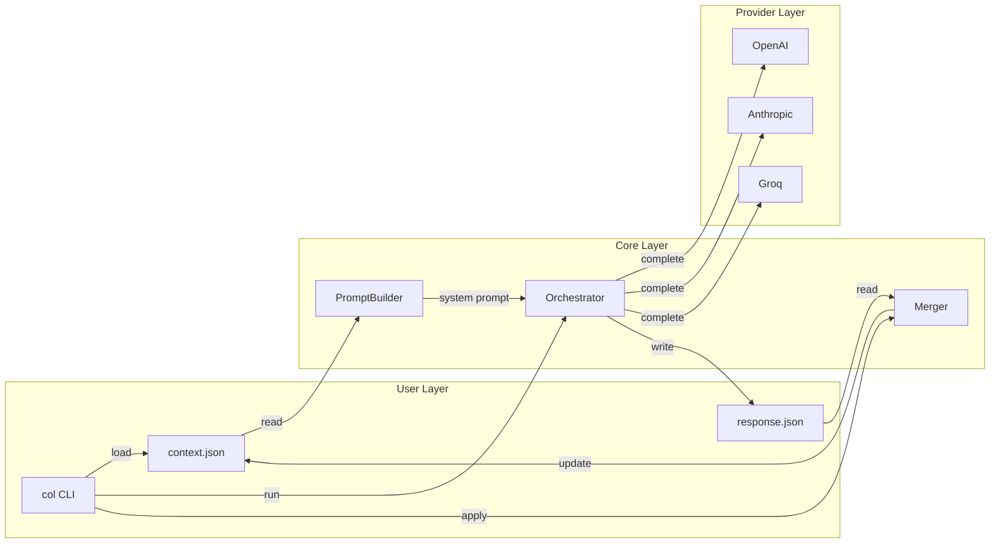

# Context Orchestration Layer (COL)

A standalone, model-agnostic context engine that preserves structured task state and allows seamless switching between LLM providers without losing progress.

## Why This Exists

Most LLM tools conflate "context" with "chat history." COL takes a different approach:

- **Context is explicit** - A structured JSON object, not hidden state
- **Context is visible** - The file on disk is the only source of truth
- **Context is portable** - Switch from OpenAI to Claude mid-task without losing progress
- **User controls mutations** - Models suggest changes, you decide what to apply

## Installation

```bash
# Create conda environment
conda create -n col python=3.11
conda activate col

# Install dependencies
pip install -r requirements.txt

# Install COL
pip install -e .
```

## Configuration

### API Keys (Required)

Set your API keys as environment variables:

```bash
export OPENAI_API_KEY="your-key"
export ANTHROPIC_API_KEY="your-key"
export GROQ_API_KEY="your-key"
```

### Optional: col.yaml

Create a `col.yaml` in your working directory for defaults:

```bash
cp col.yaml.example col.yaml
# Edit col.yaml with your preferred settings
```

Example configuration:

```yaml
default_provider: openai  # or anthropic, groq
default_model: gpt-4o     # provider-specific model name
default_context_file: context.json
default_output_file: response.json
```

**Configuration Priority:** CLI flags → Environment variables → col.yaml → Built-in defaults

See [CONFIGURATION.md](CONFIGURATION.md) for detailed configuration options.

## Usage

### Initialize a Context

```bash
col init task.json
```

Creates a new context file with this structure:

```json
{
  "goal": "",
  "constraints": [],
  "facts": [],
  "decisions": [],
  "tool_outputs": [],
  "open_questions": []
}
```

Edit this file to set your goal, constraints, and initial facts.

### Run a Completion

```bash
col run --context task.json --provider openai --instruction "What's the best approach?"

# Or use Anthropic
col run --context task.json --provider anthropic --instruction "What's the best approach?"

# Or use Groq
col run --context task.json --provider groq --instruction "What's the best approach?"
```

**Important:** The `--instruction` flag is ephemeral - it is NOT stored in the context file and does NOT persist across runs. Each run requires an explicit instruction.

The model responds with an answer and suggested context updates. The context file is NOT modified.

### Apply Updates

```bash
col apply --context task.json --response response.json
```

Review and approve the suggested changes. Only approved changes are added to the context.

### Check Metrics

```bash
col metrics --context task.json
```

Shows context size, item counts, and approximate token usage (no cost estimation).

### Run Artifacts

Each `col run` automatically creates a run artifact in `.col/runs/<timestamp>.json` for replayability and debugging.

Artifacts include:
- Provider and model used
- Prompt hash (for verifying deterministic rendering)
- Latency (if available)
- Token counts (if available)
- Raw model output
- Parsed JSON response (if valid)
- Error information (if parsing failed)

**Note:** Artifacts never modify the context file. They are for debugging and replayability only.

### Switch Providers Mid-Task

```bash
# Start with OpenAI
col run --context task.json --provider openai --instruction "Design the API"
col apply --context task.json --response response.json

# Continue with Claude
col run --context task.json --provider anthropic --instruction "Now implement it"
col apply --context task.json --response response.json

# Continue with Groq
col run --context task.json --provider groq --instruction "Review and optimize"
```

The context file works with any provider. No conversion needed.

## Context Schema

```json
{
  "goal": "The primary objective",
  "constraints": ["Hard constraints on the solution"],
  "facts": ["Established facts about the problem"],
  "decisions": ["Decisions that have been made"],
  "tool_outputs": ["Results from external tools (added manually)"],
  "open_questions": ["Unresolved questions"]
}
```

## Model Response Format

Models must return:

```json
{
  "answer": "The response",
  "suggested_context_updates": {
    "facts": [],
    "decisions": [],
    "constraints": [],
    "tool_outputs": [],
    "open_questions": []
  }
}
```

## Architecture



**Data Flow:**
1. `col run` loads the context file and builds a deterministic system prompt
2. The orchestrator calls the selected provider with the prompt and ephemeral instruction
3. The response is saved to an output file (never modifies context directly)
4. `col apply` loads the response and merges approved updates into the context

## Design Principles

1. **No chat history** - Only the structured context
2. **No embeddings** - No vector database, no RAG
3. **No hidden state** - The JSON file is everything
4. **No automation** - COL stops after every response
5. **Append-only** - New items are added, never deleted automatically
6. **User authority** - You approve all changes
7. **Deterministic prompt rendering** - Same context always produces identical prompt structure. No timestamps, randomness, or run metadata in prompts.
8. **Ephemeral instructions** - The `--instruction` flag is not persisted. It is used only for the current run and does not affect the context file.

## Error Handling

COL uses strict JSON parsing with no automatic retries or repair attempts:

- Invalid JSON responses are saved to run artifacts and the output file
- COL exits with an error code
- No automatic retries or repair attempts
- User must manually fix malformed responses

This ensures predictable behavior and prevents hidden failures.

## What COL is NOT

- An agent framework
- A tool-calling platform
- A memory system with hidden state
- A chat interface

## Limitations

COL is intentionally minimal infrastructure. These are explicit design boundaries:

- **No context pruning** - Context grows without bound. Users must manually manage size.
- **No semantic deduplication** - Only exact string matches are deduplicated.
- **No conflict resolution** - Contradictory facts/decisions are both preserved.
- **No versioning** - Context files have no version history (use git).
- **No multi-user support** - Single context file, single user.
- **No streaming** - Responses are returned as complete JSON only.
- **No automatic retries** - Failed API calls require manual re-run.
- **No cost tracking** - Token counts shown, but no cost estimation.

These limitations are features, not bugs. They keep COL simple and predictable.

## Developer Utilities

Two optional CLI commands for tooling integration:

```bash
# Validate a manually edited context file
col validate context.json

# Export the JSON Schema for IDE integration
col schema
col schema --output context-schema.json
```

These are developer utilities and are not required for normal usage.

## Using COL in Your Projects

COL is released under the MIT License. You are free to use, modify, and distribute COL in any way you see fit, including incorporating it into commercial products. The MIT License grants you maximum freedom while preserving attribution.

## Future Scope (Non-Binding)

COL is intentionally minimal. Future work, if any, will preserve explicit context, user authority, and model-agnosticism.

Potential directions (exploratory, not guaranteed):

**LLM-assisted context proposals**
- Improve how models suggest facts, decisions, and open questions (e.g., confidence scores, grouping, deduplication).
- Context mutations would remain user-approved.

**Context refactoring utilities**
- Optional commands to propose cleaned or summarized context files (append-only, non-destructive, opt-in).

**Rule-based context linting**
- Deterministic checks for large contexts, redundancy, or missing constraints (no LLM required).

**Enhanced diff and review UX**
- Further improvements beyond the current tree visualization, such as side-by-side comparison views or interactive review modes for proposed context changes.

**Additional provider adapters**
- Support for more LLM providers behind the same interface (without changing the core schema).

**Non-goals (will remain out of scope):**

- Autonomous agents or execution loops
- Hidden or implicit memory
- Tool execution or orchestration
- Vector databases, embeddings, or RAG as memory
- Automatic context mutation without user approval

## Contributing

COL is open to focused pull requests that improve correctness, clarity, or ergonomics without expanding scope.

Good PRs typically:

- Improve determinism, validation, or error handling
- Enhance documentation or demos
- Add tests or developer tooling

PRs that introduce agents, automation, or hidden state will not be accepted.

## License

MIT
